# 📜 이준희 포트폴리오

Name : 이준희 (JunHee Lee) 

Date of Birth : 1995.02.27

--- 
## 📞 Contact
Mail : junheelee95@gmail.com

--- 
## 🎓 학력
- 한양대학교(서울) 비즈니스 인포매틱스학과 석사 졸업 (2023.02)

    → 석사학위논문 : 베이지안 딥러닝을 활용한 항만물동량 예측에 관한 연구 [논문 요약 및 핵심코드 저장소 바로가기](https://github.com/iureifjdkncd/2022-MS_Thesis)

- 세종대학교 경영학과 / 비즈니스 애널리틱스학과 학사 졸업 (2021.02)

--- 

## 📄 자격사항

| 자격증명                       | 발급기관                    | 취득일       | 비고                                         |
| ---------------------------- | ------------------------- | ---------- | ------------------------------------------ |
| TOEIC (970점)                | ETS                       | 2019.06.30 | LC 490 / RC 480, (만료: 2021.06.30) |
| OPIc (Advanced Low)          | ACTFL (YBM)              | 2019.08.11 | 영어 말하기 시험, (만료: 2021.08.10)      |
| ADsP (데이터분석 준전문가)     | 한국데이터산업진흥원           | 2020.09.29 | 데이터 분석 국가공인 자격증, 자격번호: ADsP-0261663 |
| 파이썬 프로그래밍 활용능력 1급    | 한국정보인재개발원             | 2020.08.11 | 자격번호: 2007-141-00325                      |
| Microsoft AI School 수료증 | 한국마이크로소프트 / 비알프레임 | 2020.01.31 | 기초 AI 교육 프로그램 수료                     |

--- 
## 📌 Career
InterX (2023.03 ~ Present)

Position: Data Scientist / SDF R&D

주요 업무 : Time Series Forecasting, Anomaly Detection 

※ 이미지 기반 분석(CV), LLM분석은 직접 수행 경험 없음

### ⭐️ Skills
| 기술           | 실무 활용                                                                              | 내용 정리                                                    | 역량  |
| ------------ | ------------------------------------------------------------------------------------- | -------------------------------------------------------- | ---- |
| **Python**   | `pandas`, `numpy`로 데이터 분석 및 전처리 수행, `scikit-learn`, `TensorFlow` 사용한 AI 모델 개발 및 실험 | 전체 파이프라인 경험 보유 (전처리~학습), 다만 PyTorch, OpenCV는 미경험            | 중\~상 |
| **FastAPI**  | 학습된 AI모델 `REST API`로 배포하여 시스템 구현 지원, `.bat` 스크립트를 통한 `Uvicorn` 서버 자동 실행 환경 구성                                        | API 기반 시스템 구축 경험 보유, 개발팀 주도의 서비스 통합·배포 과정에서 협업 중심으로 참여             | 중    |
| **Docker**   | `Docker`를 활용한 환경 구성 스크립트 작성                              | 환경 구축은 개발팀이 주도, API 운영·배포, 환경 테스트에 협업 중심으로 참여                 | 중    |
| **Database** | `MongoDB`,`PostgreSQL`에서 조건 필터링,정렬,`limit` 쿼리 등 수행, Python 기반 조회 및 가공 경험                   | NoSQL(MongoDB)&RDB(PostgreSQL) 구조 이해, 설계,운영 경험은 없음 | 중    |
| **Git**      | GitLab에 업로드 및 commit/pull/push, `master` 브랜치 관리 경험                                            | Git 기본 명령 및 협업 경험 보유, 전략적 브랜치 운영 경험 부족           | 중\~하    |

### 📌 AI 프로젝트 프로세스 담당 구분

| 단계 | 프로세스 | 주요 담당 |
|------|----------|-----------|
| 1 | Raw Data 수집·정제 | 개발팀 / 데이터 엔지니어 |
| 2 | DB 조회 | **본인 주도** |
| 3 | 학습용 데이터 전처리 | **본인 주도** |
| 4 | AI 모델 구축 | **본인 주도** |
| 5 | Docker/FastAPI 구축 | **본인 주도 + 개발팀 협업** |
| 6 | 서비스 통합·배포·활성화 | 개발팀 주도 + 협업 |
| 7 | 시스템 모니터링 | **본인 주도 + 개발팀 협업** |

```mermaid
flowchart LR
    A[Raw Data 수집·정제]:::dev
    B[DB 조회]:::me
    C[학습용 데이터 전처리]:::me
    D[AI 모델 구축]:::me
    E[Docker/FastAPI 구축]:::me
    F[서비스 통합·배포·활성화]:::meco
    G[시스템 모니터링]:::me
    A --> B --> C --> D --> E --> F --> G
    classDef me fill:#fef3c7,stroke:#f59e0b,stroke-width:2px;
    classDef dev fill:#dbeafe,stroke:#3b82f6,stroke-width:2px;
    classDef devco fill:#e0f2fe,stroke:#0284c7,stroke-width:2px;
    classDef meco fill:#ecfdf5,stroke:#10b981,stroke-width:2px;
```

---

### 📝 Projects
 [전체 요약](https://github.com/iureifjdkncd/B2B_AI_Projects/tree/main)

#### 1. 비지도 학습 기반 사출 품질 예측 및 최적 세팅 추천 시스템 (A사 자동차 부품 제조기업)
- 기간 : 2023.08 ~ 2025.07 (약 23개월)

- 역할 : AI 모델 개발 및 솔루션 모니터링

- 기술 : Python, TensorFlow, Scikit-Learn, FastAPI, MongoDB, PostgreSQL

- 설명 : K-Means 기반 조건 분류와 AutoEncoder 계열 모델을 활용해 불량 탐지 정확도를 16% 향상시키고, 예측 기반 라벨링으로 불량률 5% 감소에 기여

- [프로젝트 상세 설명](https://github.com/iureifjdkncd/B2B_AI_Projects/tree/main/Project_A)

---

#### 2. 확률적 시계열 예측 기반 제당 공정 품질 추론 및 조건 최적화 시스템 (S사 제당공정 기업)

- 기간 : 2024.05 ~ 2025.03 (약 10개월)

- 역할 : AI 모델 개발 및 솔루션 모니터링

- 기술 : Python, TensorFlow, Scikit-Learn, FastAPI, MongoDB

- 설명 : Quantile Regression과 Monte Carlo Dropout 기반 BiLSTM 모델 및 KDE를 활용해 예측 정확도 95%(실험) / 85 ~ 87%(현장) 달성, 작업자 기반 RuleBased vs AI예측기반 추천조건 운전 시 설탕 품질 약 1% 향상

- [프로젝트 상세 설명](https://github.com/iureifjdkncd/B2B_AI_Projects/tree/main/Project_B)

---

#### 3.) 사출 설비 품질 예측 및 조건 추천 통합 시스템 (N사 자동차 부품 제조기업)
- 기간 : 2023.05 ~ 2025.03 (약 22개월)

- 역할 : AI 모델 개발 및 솔루션 모니터링

- 기술 : Python, TensorFlow, Scikit-Learn, FastAPI, MongoDB

- 설명 : 비지도 기반 실시간 예측 체계 설계로 불량 탐지 정확도 14% 향상, K-Means 기반 조건 추천 알고리즘으로 실제 조건과 3~5% 내 오차 유지

- [프로젝트 상세 설명](https://github.com/iureifjdkncd/B2B_AI_Projects/tree/main/Project_C)

---

#### 4.) 사출 설비 불량 예측 모델 개발 및 TTA 인증 대응 (S사 자동차 부품 제조기업)

- 기간 : 2023.08 ~ 2023.09 (약 1개월)

- 역할 : AI 모델 개발 및 보고서 작성 보조

- 기술 : Python, Scikit-Learn, MongoDB

- 설명 : Tree 기반 모델로 F1 95% 이상 달성, TTA 인증을 위한 모델 안정성 검증 및 시스템 준비 완료

[프로젝트 상세 설명](https://github.com/iureifjdkncd/B2B_AI_Projects/tree/main/Project_D)

---

#### 5.) Cogging Motor 기반 조립·병렬 공정 불량 탐지 POC 수행 (M사 모터 제조기업)
- 기간 : 2024.07 ~ 2024.08 (약 1개월)

- 역할 : AI 모델 개발 및 제안서 작성 보조

- 기술 : Python, Scikit-Learn

- 설명 : XGBoost 기반 공정 불량 탐지 모델 개발 및 공정별 AI 적용 가능성 분석, 일부 공정 F1 75~91% 성능 확보

- [프로젝트 상세 설명](https://github.com/iureifjdkncd/B2B_AI_Projects/tree/main/Project_E)

---
#### 6.) 고속 사출기 불량 탐지 AI 모델 POC 수행 (L사 산업용 기계 제조기업)
- 기간 : 2023.11 ~ 2023.12 (약 1개월)

- 역할 : AI 모델 개발 및 제안서 작성 보조

- 기술 : Python, Scikit-Learn

- 설명 : Raw 데이터 표준화 및 Optuna 기반 모델 고도화로 F1 70%에서 82%로 향상, 고속 주기 조건 대응 실시간 예측 구조 설계

- [프로젝트 상세 설명](https://github.com/iureifjdkncd/B2B_AI_Projects/tree/main/Project_F)

---

## 📝 Research 
[전체 요약](https://github.com/iureifjdkncd/Research)

#### 1.) Recipe Based Anomaly Detection with Adaptable Learning: Implications on Sustainable Smart Manufacturing(2025)

- 기간 : 2024.10 ~ 2025.02 (약 5개월)

- 역할 : 분석 전략 기획, AI 고도화 연구, 논문 작성

- 기술 : Python, Scikit-Learn, TensorFlow, Overleaf

- 설명 : 도메인별 품질 문제 정의 및 모델링 전략 수립, 불량 탐지 정확도 30~50% 이상 향상 기여, SCI급 논문 1저자 등재 (MDPI Sensors 저널 게재)

- [논문 링크](https://doi.org/10.3390/s25051457)
   
---

#### 2.) A Two-Stage Deep Learning Framework for Uncertainty-Aware Forecasting and Conditional Process Optimization Toward Sustainable Smart Manufacturing (2025)

- 기간 : 2025.06 ~ 2025.08 (약 2개월)

- 역할 : 분석 전략 기획, AI 고도화 연구, 논문 작성

- 기술 : Python, TensorFlow, Overleaf

- 설명 : Forecast-Aware Reconstruction기반 Time Series Generation Module 설계, 
실제 제조 데이터 및 벤치마크 데이터셋에서 예측 정확도 최대 35.7%, Prediction Interval 적합도 최대 25.2% 개선, 
SCI급 논문 1저자 작성 

- [제출 예정](https://www.preprints.org/manuscript/202508.0377/v1)

---

## 🏆 Contest 

#### 1.) 제10회 산업통상자원부 공공데이터 활용 BI 공모전  최우수상 (KOTRA 사장상 수상)

- 과제명 : 한국 수출금액 예측 모델 기반 기업수요 맞춤형 서비스
  
- 기간 : 2022.05 ~ 2022.08 (약 3개월)

- 역할 : 시계열 예측 모델 설계, 정량 분석, 추론 해석, 보고서 및 발표 자료 작성, 공모전 바탕 학회 논문 작성

- 기술 : Python, Statsmodels, Scikit-Learn, TensorFlow, Excel, Tableau

- 설명 : 한국 수출금액 예측을 위해 VECM과 Monte Carlo Dropout 기반 Multi Horizon Forecast (Seq2Seq)를 병행 적용하고, 예측 기반 추천 품목 도출 방안을 함께 설계하여 예측 정확도, 불확실성 해석력, 비즈니스 활용 가능성을 동시에 확보

- [공모전 정리](https://github.com/iureifjdkncd/2022_KOTRA_BI)

- [학회 논문 링크](https://www.dbpia.co.kr/Journal/articleDetail?nodeId=NODE11207563)

---
